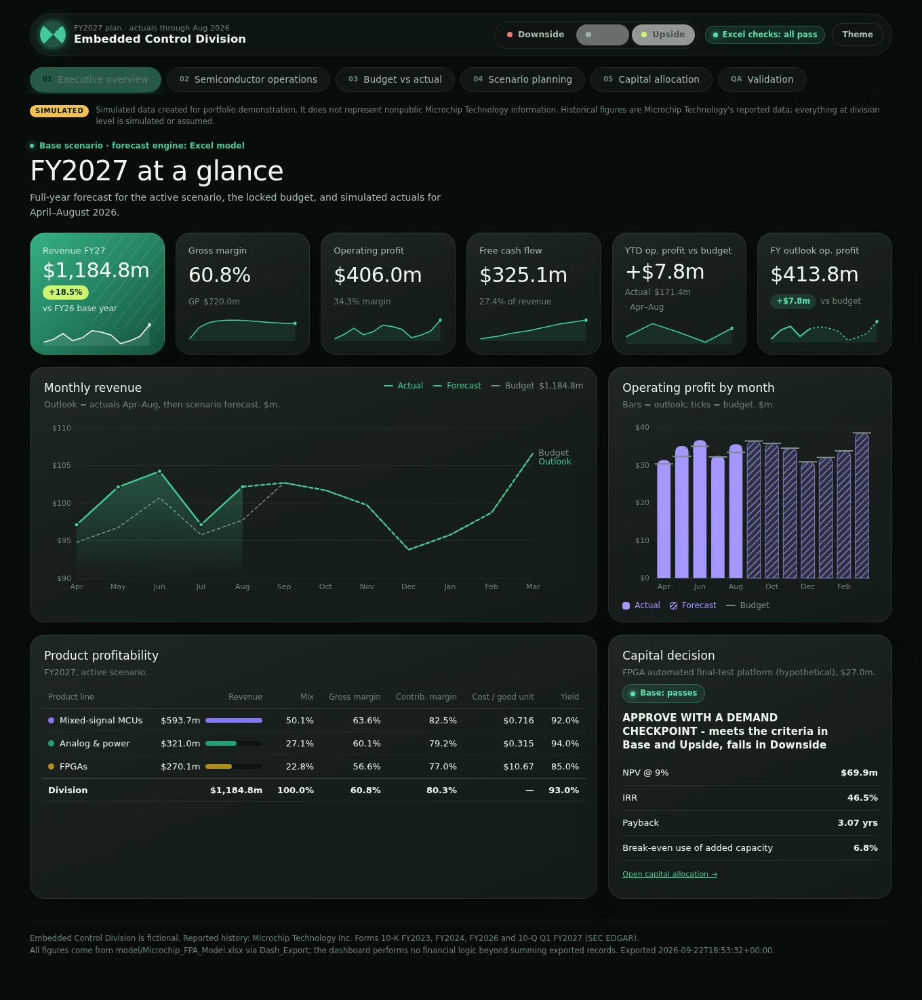
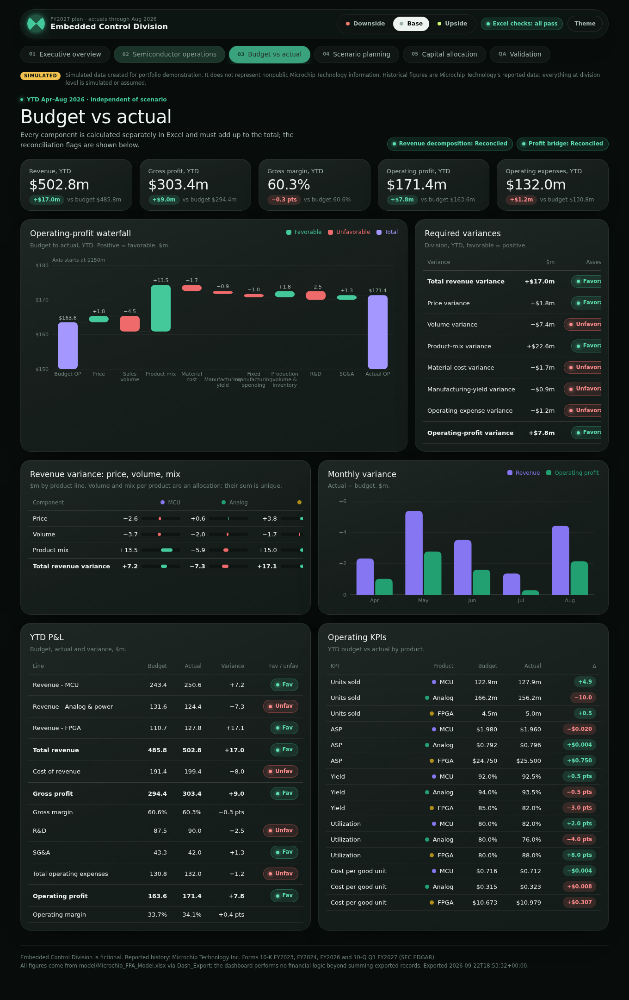
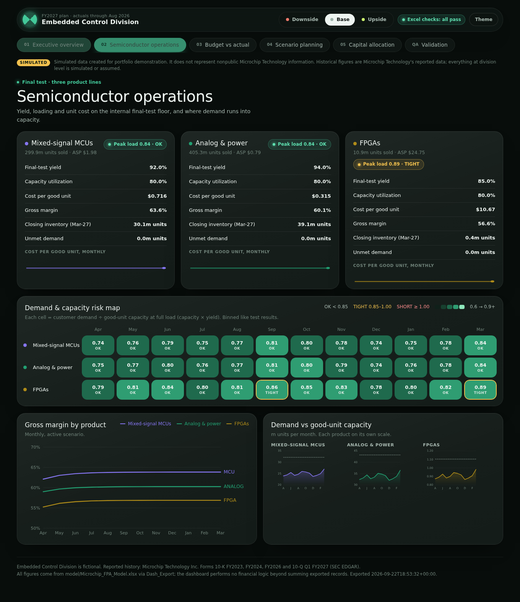
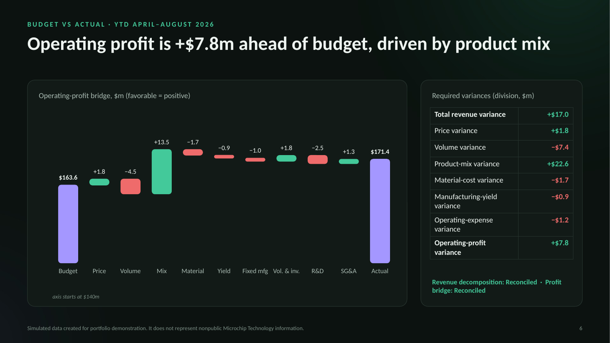

# Semiconductor FP&A Forecasting and Decision Model

**An end-to-end FP&A project for a semiconductor product division:** a fully linked Excel model, a custom web
dashboard and an executive deck, all driven by the same numbers and checked against each other automatically.

It answers one question a CFO or business-unit leader would ask:

> How would changes in demand, selling price, product mix, manufacturing yield, capacity utilization, operating costs
> and capital spending affect the division's revenue, operating profit and free cash flow?



> **Simulated data created for portfolio demonstration. It does not represent nonpublic Microchip Technology information.**
> The "Embedded Control Division" is fictional. Only the five-year history comes from Microchip Technology's SEC filings;
> every division-level figure is simulated or assumed, and labeled as such.

## Headline results (FY2027, Base scenario)

| | |
|---|---|
| Revenue | **$1,184.8m**, +18.5% vs the FY2026 base year |
| Operating profit | **$406.0m** (34.3% margin) |
| Free cash flow | **$325.1m** (27.4% of revenue) |
| YTD operating profit vs budget (Apr–Aug 2026) | **+$7.8m** (+4.8%), led by product mix (+$13.5m) |
| Scenario range, operating profit | $253.5m (Downside) to $513.3m (Upside) |
| Capex: $27m FPGA test platform | NPV **+$69.9m**, IRR 46.5%, payback 3.1 years (Base); NPV −$14.1m in Downside |
| Recommendation | **Approve with a demand checkpoint**: passes every criterion in Base and Upside, fails in Downside |

### Second company: Texas Instruments (FY2026, Base scenario)

The same engine, tests and page templates, run from `companies/TXN/config.toml`. The division is the fictional
"Power, Signal & Embedded Division". Power management and signal chain are an **assumed 50/50 split** of TI's
reported Analog segment, and embedded processors map to Embedded Processing.

> **Simulated data created for portfolio demonstration. It does not represent nonpublic Texas Instruments information.**

| | |
|---|---|
| Revenue | **$1,145.5m**, +14.6% vs the FY2025 base year |
| Operating profit | **$434.9m** (38.0% margin) |
| Free cash flow | **$379.3m** (33.1% of revenue) |
| YTD operating profit vs budget (Jan–May 2026) | **+$3.8m** |
| Scenario range, operating profit | $314.5m (Downside) to $531.7m (Upside) |
| Capex: $24.5m power-management final-test cell | NPV **+$60.4m**, IRR 51.6%, payback 2.4 years (Base); NPV −$15.9m in Downside |
| Recommendation | **Approve with a demand checkpoint** |

Outputs: `outputs/TXN/` (model, dashboard, deck, sources log, test results).

## What's inside

| Deliverable | File | Highlights |
|---|---|---|
| Excel FP&A model | `outputs/MCHP/model/MCHP_FPA_Model.xlsx` | 15 tabs, ~6,800 formulas, one scenario selector, 149 live checks |
| Management dashboard | `outputs/MCHP/dashboard/index.html` | 5 pages + a validation page; opens in any browser, no install; verified against Excel |
| Executive presentation | `outputs/MCHP/presentation/Embedded_Control_FY27_Executive_Review.pptx` | 10 slides with speaker notes; every figure read from the model |
| Sources & assumptions log | `outputs/MCHP/docs/sources_and_assumptions.md` | 5 SEC filings, 263 reported values with citations, 37 logged assumptions |
| Methodology | `docs/methodology.md` | Every formula, the variance method and the capex decision rule |
| Data dictionary | `docs/data_dictionary.md` | The dashboard's data file, table by table |
| Power BI mapping | `docs/powerbi_appendix.md` | Power Query steps and DAX measures for the same pages |
| Multi-company engine | `docs/engine.md` | How to run the same model for another company from one config file |

### The model connects engineering drivers to financial outcomes

```
Demand, price, yield, utilization, costs  ->  units produced -> good units -> units sold
  ->  revenue, cost of revenue, gross profit  ->  operating profit  ->  free cash flow
  ->  budget variance, scenario range, capital decision
```

- **Operating model:** three product lines (mixed-signal MCUs, analog & power, FPGAs), monthly, with capacity, utilization,
  yield, inventory, weighted-average costing, contribution margin and gross profit.
- **Scenarios:** nine drivers × Downside / Base / Upside, switched by one cell; no duplicated models.
- **Budget vs actual:** price, volume, mix, material, yield, fixed-spending and opex variances that reconcile exactly to the total.
- **Capital decision:** a hypothetical FPGA test platform with NPV, IRR, payback and break-even utilization in every scenario.

| Budget vs actual | Operations risk map |
|---|---|
|  |  |



## How it is validated

Nothing is claimed as verified until it has been compared with an independent calculation.

| Check | Result |
|---|---|
| Reported SEC data: statements add up, cross-filing agreement, no duplicates | 88 / 88 pass |
| Excel Checks tab (live in the workbook) | 149 / 149 pass, 0 formula errors |
| Independent Python rebuild of every phase, all three scenarios | matches Excel to rounding noise (~1e-13) |
| Exported dashboard data vs Excel | 88 / 88 pass |
| Rendered dashboard (headless browser) vs Excel control totals | 67 / 67 pass; 38 displayed values matched |
| Engine regression: Microchip outputs before vs after the multi-company refactor | 0 differences (3 documented deck-text changes) |

Figures above are for Microchip; Texas Instruments passes the same tests (147 / 147 Excel checks). Full run logs: `outputs/MCHP/tests/VALIDATION_SUMMARY.md` and `outputs/TXN/tests/VALIDATION_SUMMARY.md`.

## Run it yourself

Requirements: Python 3.11+, Node.js 18+, and [LibreOffice](https://www.libreoffice.org/download/) for automated
recalculation. Tested on Linux and Windows 11.

```bash
pip install -r requirements.txt
python -m playwright install chromium      # only needed for the browser test
npm install                                 # PptxGenJS for the presentation
python scripts/run_all_validations.py --company MCHP   # build, recalculate, test, export, dashboard, deck, docs
python scripts/run_all_validations.py --company TXN
```

Windows notes: if PowerShell blocks `npm`, run `npm.cmd install`. `requirements.txt` installs markitdown with its
PowerPoint support, which the deck-text step needs.

That one command rebuilds the workbook from code, recalculates it, runs every test, exports the dashboard data,
rebuilds the dashboard page and the deck, and writes `outputs/MCHP/tests/VALIDATION_SUMMARY.md`. Each step reports PASS or FAIL.
Another company is a new folder under `companies/` with its own `config.toml` and reported data; see `docs/engine.md`.
Texas Instruments is built the same way: `python scripts/run_all_validations.py --company TXN` (outputs in `outputs/TXN/`).
To try another scenario by hand, open the workbook and change the yellow cell `Assumptions!C6`.

Just want to look? Open `outputs/MCHP/dashboard/index.html` in a browser, `outputs/MCHP/model/MCHP_FPA_Model.xlsx` in Excel, or the deck in PowerPoint.

## Repository layout

```
companies/<TICKER>/  Everything company-specific (MCHP, TXN): config.toml, reported SEC data (one source row per value),
                   source register, assumptions log, cross-filing checks
scripts/           The generic engine: model build (build_model.py + phase modules), recalculation, export,
                   dashboard, deck, docs, run_all_validations.py
dashboard/         template.html (the dashboard source; filled per company)
presentation/      Deck artwork
tests/             Independent validation scripts and the pre-engine Microchip baseline
outputs/<TICKER>/  Generated deliverables: model, dashboard, deck, docs, test results and screenshots
docs/              Methodology, data dictionary, engine guide, Power BI appendix, images
```

## Build history

| Phase | Scope |
|---|---|
| 0 | Folder setup, SEC data collection with a citation per value, source and assumptions logs |
| 1 | Historical financial analysis (FY2022–FY2026) |
| 2 | Assumptions, single scenario selector, product × month operating model |
| 3 | Monthly revenue, P&L and free-cash-flow forecast |
| 4 | Locked budget, simulated actuals, variance decomposition with reconciliation flags |
| 5 | Capital-investment analysis: NPV, IRR, payback, break-even, decision rule |
| 6 | Dashboard export tables, export script, full validation runner |
| 7 | Web dashboard, browser validation, Power BI appendix |
| 8 | Executive presentation |
| 9 | Repository documentation |
| 10 | Multi-company engine: one config file per company, regression-tested against the Microchip build |
| 10c | Second company: Texas Instruments (`outputs/TXN/`), built with the same engine and the same tests |

## Tools

Excel (generated with openpyxl, recalculated with LibreOffice) · Python (standard library, openpyxl, Playwright) ·
HTML / CSS / vanilla JavaScript with hand-built SVG charts · PptxGenJS · SEC EDGAR filings.

## Limitations

The division, its operating data, the April–August actuals and the capital proposal are simulated. Historical ratios
describe Microchip Technology as a whole and are used only as context and calibration. See `docs/methodology.md` §10.
